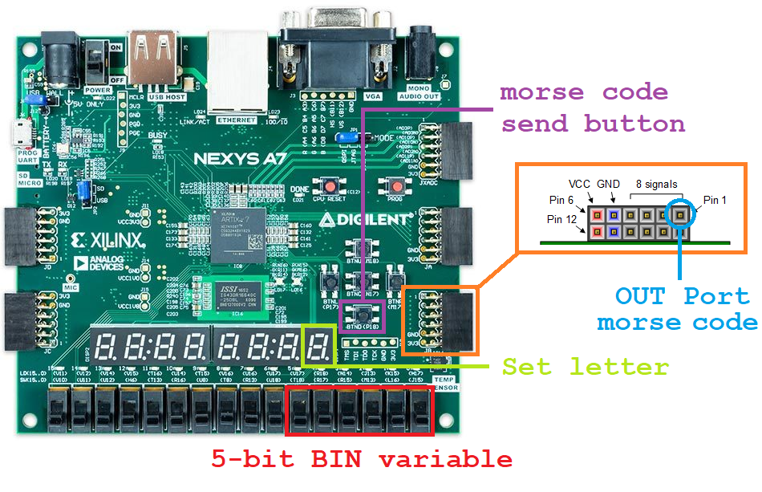
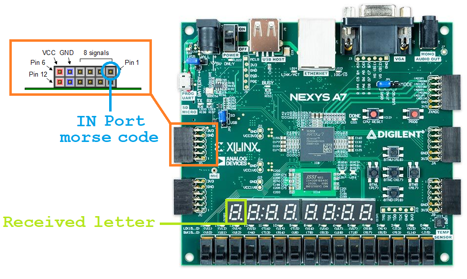
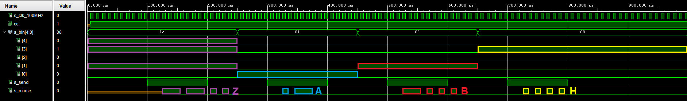
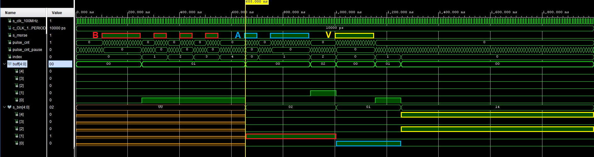
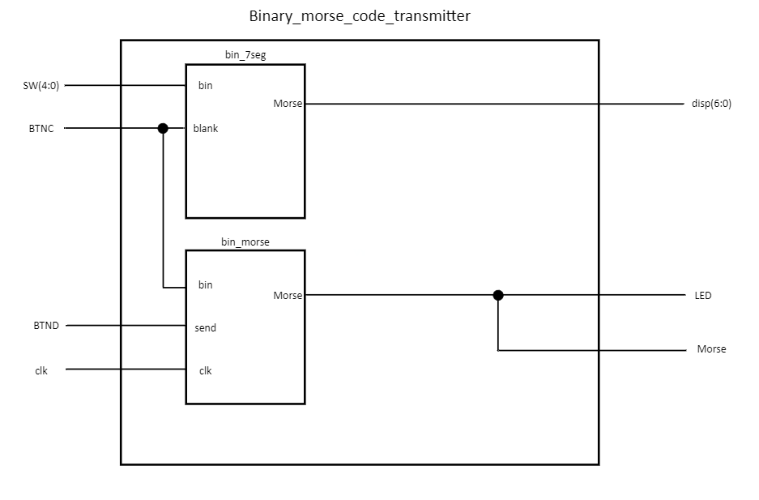
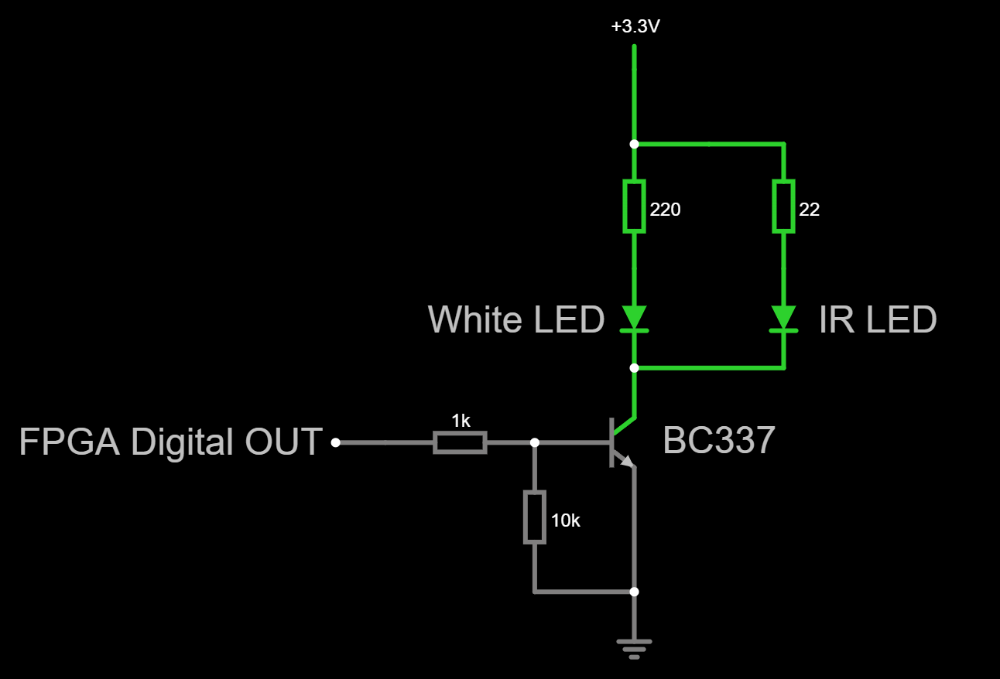
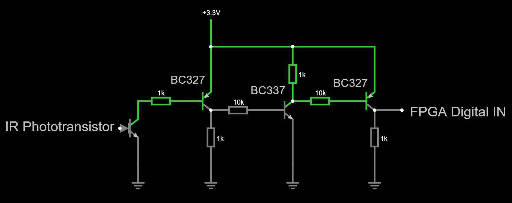

# Morse code transmitter and receiver  

## Team members
* Martin Ťavoda
* Vojtěch Drtina
* Jan Gadas
* Miloslav Kužela

## Theoretical description and explanation

Our project is focused on transmitting and receiving letters using MORSE code via IR signal between 2 FPGA boards.  
User can set an input letter by using five slide switches of FPGA board as binary coded  position number in alphabet.   For example: A => 00001 (1), D => 00100 (4), M => 01101 (13). The set letter is also displayed on one 7-segment display. 
After pressing the BTND button, the character is transmitted as morse code. 

On the receiving FPGA board, the incoming letter is instantly displayed on 7-segemnt, without any need of user interaction.

## Hardware description of demo application

### Transmitter

We transmit the output signal form FPGA board via IR LED, which we feed with NPN transistor, because the FPGA PMOD port cannot supply enough current. We also used an external white LED and buzzer to demonstrate the outgoing morse signal.

### Receiver

As external receiver we used IR-phototransistor. Since we needed to overcome the problem with low slew rate, we come with solution with Sziklai pair. We connected two of these pairs in cascade, which improved our slew rate significantly. Therefore, the ramp of rising edge lasts only 50 ns.

## Software description

### Transmitter

The [top_transmitter](morse_transmitter/morse_transmitter.srcs/sources_1/new/top.vhd) has four input and three output ports. It includes two entities. [Bin_7seg](morse_transmitter/morse_transmitter.srcs/sources_1/new/bin_7seg.vhd), which converts the input binary code to individual segment to be set on the display. The segment can be blanked by pressing a button (BTNC). The second entity [(bin_morse)](morse_transmitter/morse_transmitter.srcs/sources_1/new/bin_morse.vhd) of top design is the main converter from binary format of letter to morse code. It contains the [prescaler](morse_transmitter/morse_transmitter.srcs/sources_1/new/clock_enable.vhd), which divide the main clock by g_max = 10 000 000. That means, the morse converter is controlled by clock with period of 100 ms.

### Receiver

The software of receiving FPGA board is very similar to the transmitter. The [top design](morse_receiver/morse_receiver.srcs/top_receiver.vhd) source also contains two entities. First one, called [morse_bin](morse_receiver/morse_receiver.srcs/morse_bin.vhd), parse the input morse code to bin representation of a letter. The conversion is done by decision of counter value, which is incremented during high pulse of input signal. If the value is 5 the input signal represents dot if it's 15 the signal represents dash. A low pulse is also followed by another counter, which when it reaches 200 ms, the reception of letter is considered as finished. All counters in this entity are feed by [prescaler](morse_receiver/morse_receiver.srcs/clock_enable.vhd) of constant g_max = 2 000 000, which coresponds to 20 ms.   The second part of top design is the same binary to 7 segment [converter](Z:/PC-II-SummerSemester/BPC-DE1-project/morse_receiver/morse_receiver.srcs/bin_7seg.vhd) as in the transmitter.

### Block diagrams of software 

Dva obrázky diagramov.

### Waveforms from simulation

#### Transmitter

#### Receiver

## Instructions
Usage of the transmitter is as follows:
1. By using position switches on the Nexys 4 Artix 7 FPGA development board, user can select a desired letter to be sent.
2. BTND button serves as a send button. By pressing it, the transmitter sends the morse code to the receiver by an IR LED.
   The progress can be observed on an LED connected parallel to the sending output.
   
Receiver doesn't require any intervention by the user. It's always waiting for an incoming transmission  and displays it on a 7 segment display.

[Working demonstration video](https://youtu.be/yEXXWRQE4EQ)

## References

1. [NEXYS A7 50T Reference Manual](https://digilent.com/reference/programmable-logic/nexys-a7/reference-manual)
2. nejaký VHDL cheat-sheet
3. [Falstad Circuit simulator](https://www.falstad.com/circuit/circuitjs.html)

## Transmitter Circuit

## Receiver Circuit

